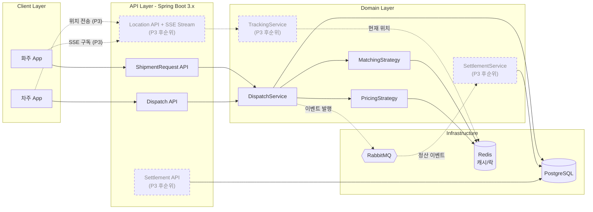
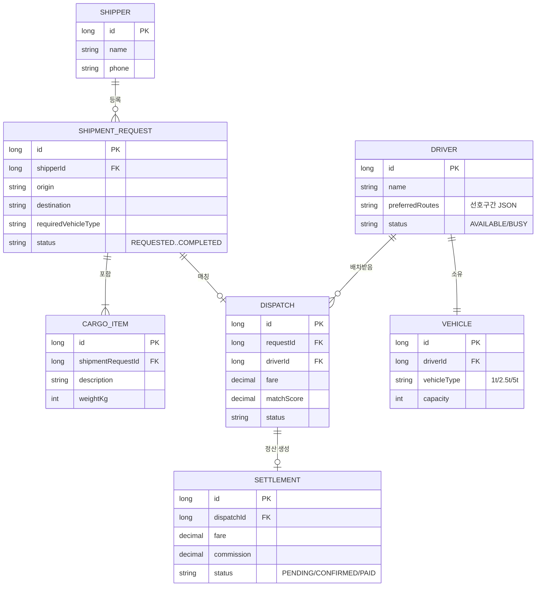
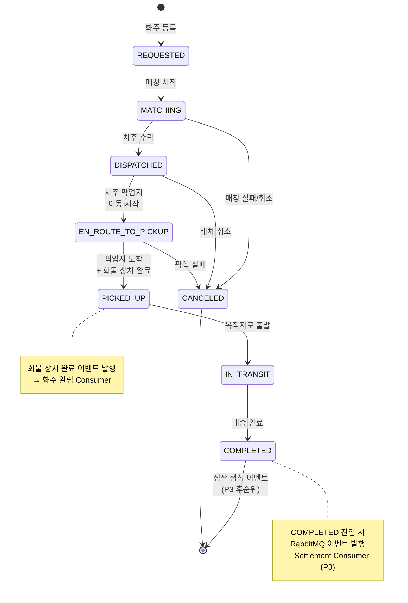
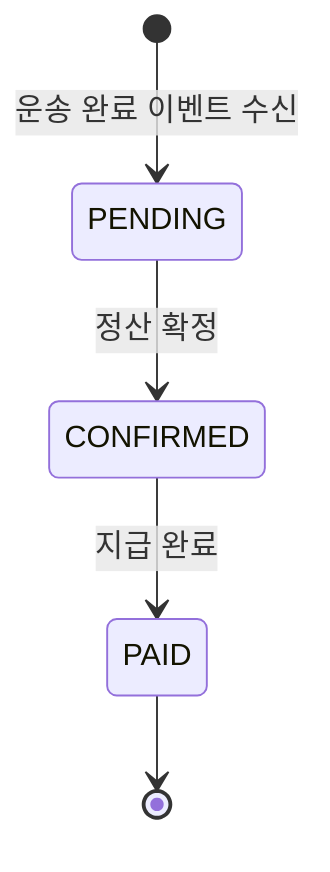
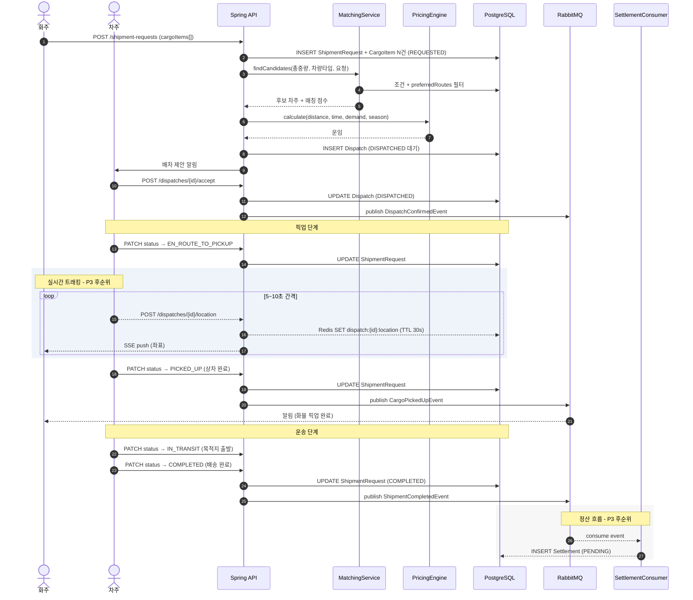
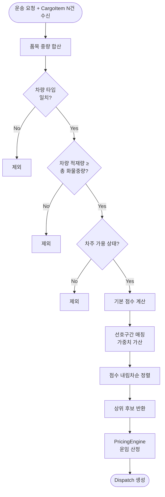
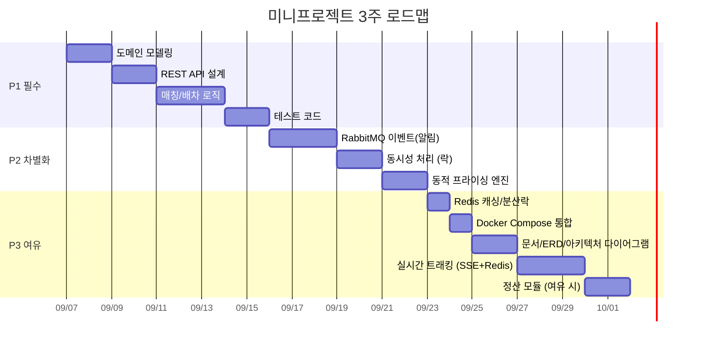

# CJ대한통운 '더운반' 미니프로젝트 시각화

> 원본: [CJ대한통운_미니프로젝트_설계가이드.md](CJ대한통운_미니프로젝트_설계가이드.md)
> Mermaid 렌더링: VS Code Mermaid Preview 확장 또는 https://mermaid.live/
> **스코프 조정**: 정산(Settlement) + 실시간 위치 트래킹(Tracking)은 **P3 후순위**로 표시 (점선/노트로 구분).

---

## 1. 시스템 아키텍처 (전체 컴포넌트)

가이드 §3.1~§3.9 에서 언급된 컴포넌트를 4계층으로 배치.

---

## 2. 도메인 모델 (ER 다이어그램)

가이드 §3.1 의 엔티티들 관계.

---

## 3. 상태 전이 (운송 요청 State Machine)

가이드 §3.1 상태 전이 규칙.

---

## 4. 정산 상태 전이 · **P3 후순위**

> 정산 모듈은 초기 스코프에서 제외. 아래는 향후 확장 시 참고용.

---

## 5. 엔드투엔드 시퀀스 (요청 → 매칭 → 배차 → 정산)

가이드 §2 핵심 시나리오 + §3.5 비동기 이벤트 흐름.

---

## 6. 매칭 파이프라인 (알고리즘 흐름)

가이드 §3.2 매칭/배차 알고리즘.

---

## 7. 우선순위 로드맵 (Gantt)

가이드 §5 우선순위를 3주 일정으로 배치.

