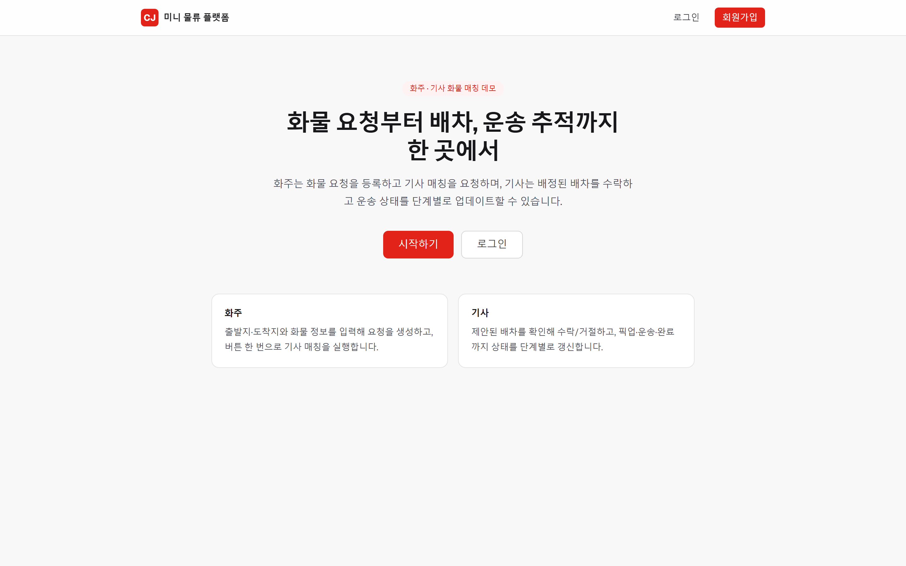
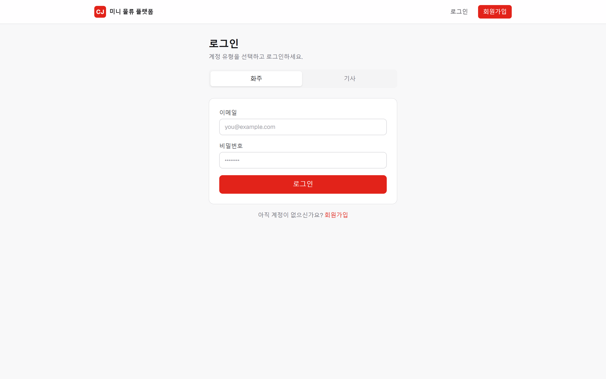
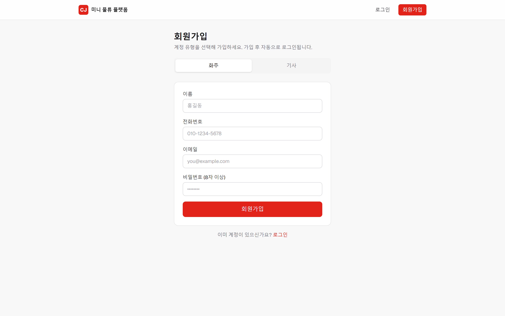
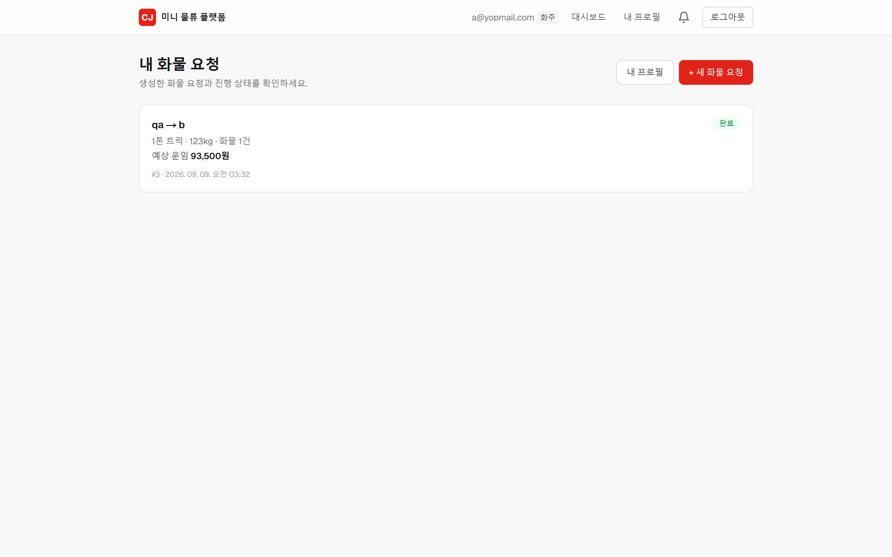
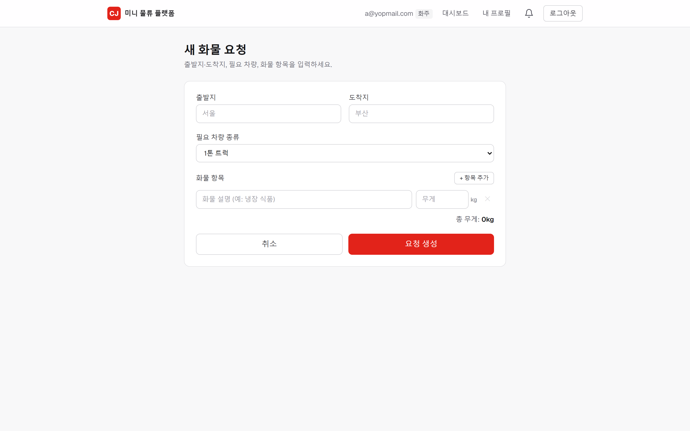
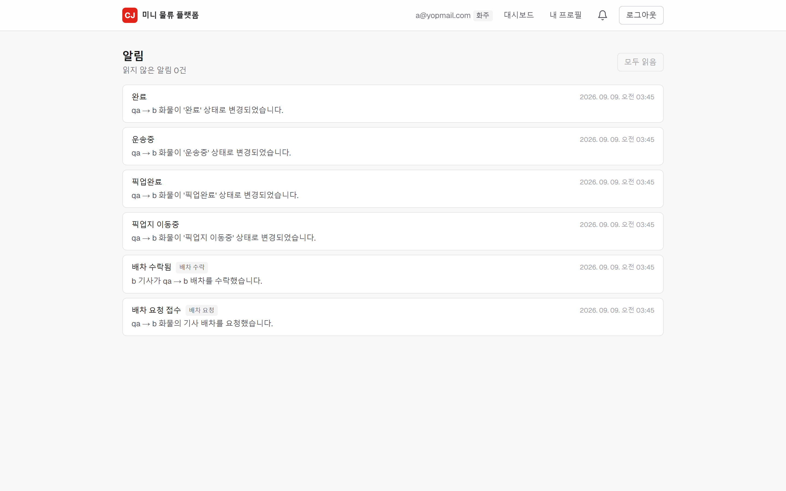
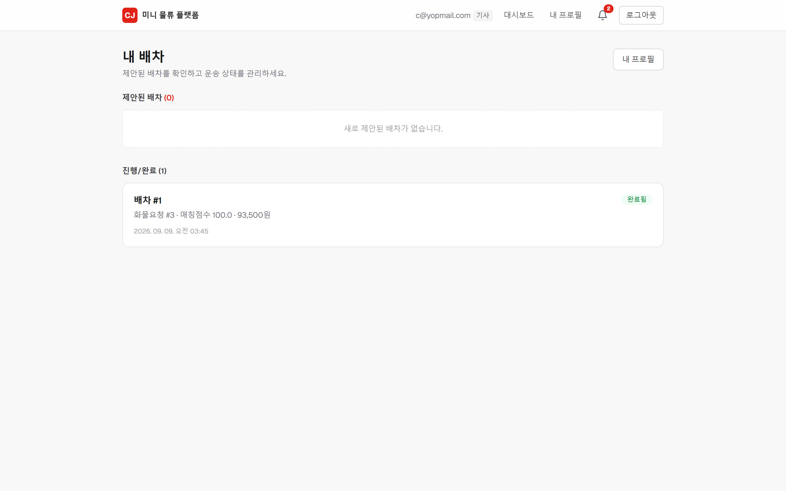
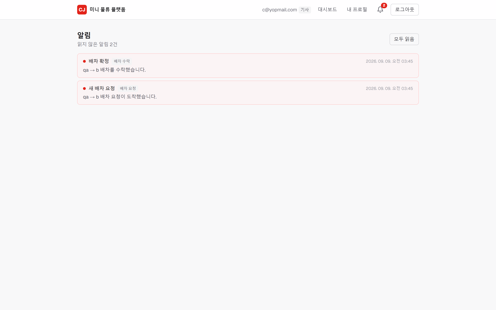

# CJ Logistics Mini — 구현 문서

물류 배차 도메인을 축소 구현한 풀스택 사이드 프로젝트입니다. 화주(Shipper)가 화물 운송을 요청하면, 조건에 맞는 기사(Driver)를 매칭·배차하고, 운송 상태를 추적하며 실시간 알림을 전달합니다.

- 라이브 데모: https://d1igl0x2mkyq92.cloudfront.net
- 데모 계정
  - 화주: `a@yopmail.com` / `1q2w3e4r!`
  - 기사: `c@yopmail.com` / `1q2w3e4r!`

---

## 1. 기술 스택

| 구분 | 사용 기술 |
|---|---|
| Language / Runtime | Java 17 |
| Framework | Spring Boot 4.0.0 (Web MVC, Data JPA, Validation, Security) |
| 인증 | Spring Security + JWT (`jjwt` 0.12.6) |
| 메시징 | Spring AMQP + RabbitMQ (Topic Exchange, DLX/DLQ) |
| DB | PostgreSQL(운영) / H2(로컬·테스트) |
| API 문서 | springdoc-openapi 2.7.0 (Swagger UI) |
| 실시간 | SSE (Server-Sent Events) |
| 테스트 | JUnit5, Mockito, Spring Security Test, **Testcontainers**(RabbitMQ), Awaitility, AssertJ |
| Frontend | Next.js 16 (App Router, 정적 export), React 19, TypeScript, Tailwind CSS 4 |
| Infra | AWS EC2(Docker Compose) · RDS PostgreSQL · S3 · CloudFront · ECR Public |

---

## 2. 시스템 아키텍처

```
[브라우저]
   │  HTTPS
   ▼
[CloudFront]  (단일 도메인)
   ├─ /*        →  S3 (프론트 정적 파일, OAC 접근제어 + SPA 라우팅 Function)
   └─ /api/*    →  EC2:8080 (HTTP 프록시)
                     │
                     ▼
              [Spring Boot (Docker)]  ──▶  RDS PostgreSQL
                     │
                     └── (같은 Compose 네트워크) ──▶ RabbitMQ
```

- 프론트와 API를 **하나의 CloudFront 도메인**으로 통합해 CORS/Mixed-Content 문제를 제거했습니다.
- 뷰어↔CloudFront는 HTTPS, CloudFront↔EC2는 HTTP로, TLS는 엣지에서 종단 처리합니다.
- 백엔드 이미지는 ECR Public에 push하고 EC2는 pull만 수행합니다(EC2 빌드 부하 제거).

---

## 3. 도메인 구조

패키지 루트: `com.cjlogistics.mini`

| 패키지 | 책임 |
|---|---|
| `auth` | 회원가입/로그인, JWT 발급 |
| `shipper` | 화주 엔티티/서비스 |
| `driver` | 기사·차량(Vehicle)·선호노선(PreferredRoute), 상태 관리 |
| `shipment` | 화물 요청(ShipmentRequest)·화물 항목(CargoItem), 상태 전이 |
| `dispatch` | 배차·매칭 전략·운임 계산 |
| `dispatch.event` | Outbox 이벤트 저장/릴레이, RabbitMQ 설정, 컨슈머 |
| `notification` | 알림 저장 + SSE 실시간 푸시 |
| `security` | SecurityConfig, JWT 필터/서비스 |
| `common` | 전역 예외 처리, 공통 응답, `/api` 프리픽스, OpenAPI |
| `demo` | 데모 데이터 초기화 |

### 엔티티 관계

- Shipper 1 ── N ShipmentRequest 1 ── N CargoItem
- ShipmentRequest ── Dispatch (배차 시 생성)
- Driver 1 ── 1 Vehicle, Driver 1 ── N PreferredRoute, Driver 1 ── N Dispatch

---

## 4. 핵심 기능

### 4.1 인증 / 인가
- 무상태(STATELESS) JWT 인증. 토큰에 `email(subject)`, `role`, `profileId` 클레임을 담고 HMAC-SHA로 서명.
- `JwtAuthenticationFilter`가 `Authorization: Bearer` 헤더를 파싱해 `ROLE_{role}` 권한을 SecurityContext에 세팅.
- **이중 방어**: `SecurityConfig`의 역할 기반 URL 접근제어 + 서비스 계층의 소유권 검증(`verifyShipperOwnership` / `verifyDriverOwnership`).

### 4.2 화물 요청 (Shipper)
- 생성 → 목록/상세 조회 → 취소. 상태는 엔티티 메서드로만 전이하며 불법 전이는 예외로 차단.
- 응답에 `FareCalculator` 기반 예상 운임을 포함.

### 4.3 배차 매칭 (Dispatch)
- **후보 조회**: 가용 기사 중 차량 종류 일치 + 적재중량 충족 기사를 점수순으로 반환(읽기 전용).
- **매칭 점수(전략 패턴)**: 기본 100점 + 선호노선 일치 시 30점 가산. `MatchingStrategy` 인터페이스로 알고리즘 교체 가능.
- **배차 생성**: 화주가 특정 기사를 지정하거나 1등 후보를 자동 선택.
- **동시성 제어**: 기사 조회 시 비관적 락(`findByIdForUpdate`) + 진행 중 배차(`PROPOSED`/`ACCEPTED`) 중복 검사로 중복 배차 방지.
- 기사 수락/거절, 운송 상태 진행(픽업→운송→완료). 완료 시 기사 상태를 AVAILABLE로 복귀.

### 4.4 운임 계산
```
운임 = (기본 50,000원 + 100원 × 총중량kg)
        × 차량계수(1T 1.0 / 2.5T 1.3 / 5T 1.6 / 11T 2.2)
        × 노선계수(동일지역 1.0 / 타지역 1.5)   → 100원 단위 반올림
```

### 4.5 실시간 알림 (SSE)
- `NotificationSseService`가 "역할:프로필ID" 키로 `SseEmitter`를 관리(멀티탭 대응, 30분 타임아웃 후 클라이언트 자동 재연결).
- 알림 생성 시 DB 저장 후 해당 수신자에게 새 알림 + 미읽음 개수를 즉시 push.
- `EventSource`가 커스텀 헤더를 못 보내는 제약 때문에, 스트림 엔드포인트는 JWT를 쿼리 파라미터로 인증.

### 4.6 이벤트 메시징 (Outbox 패턴 + RabbitMQ)
- 배차 확정/운송 완료 시, 비즈니스 트랜잭션 안에서 이벤트를 `outbox_events` 테이블에 `PENDING`으로 저장 → **DB와 메시지 발행의 일관성 보장**.
- `OutboxEventRelay`가 `@Scheduled`(기본 1초)로 PENDING 이벤트를 조회해 RabbitMQ에 발행하고 `PUBLISHED`로 전이.
- Topic Exchange + **DLX/DLQ** 구성으로 컨슈머 반복 실패 시 메시지를 격리.
- `@ConditionalOnProperty(app.messaging.enabled)`로 메시징 활성/비활성 전환.

---

## 5. API 개요

모든 애플리케이션 API는 `/api` 프리픽스가 붙습니다(`WebMvcConfig`의 `PathMatchConfigurer`). Swagger/H2 콘솔은 제외됩니다.

| 메서드 | 경로 | 설명 | 권한 |
|---|---|---|---|
| POST | `/api/auth/shippers/signup` | 화주 회원가입 | 공개 |
| POST | `/api/auth/drivers/signup` | 기사 회원가입 | 공개 |
| POST | `/api/auth/shippers/login` | 화주 로그인 | 공개 |
| POST | `/api/auth/drivers/login` | 기사 로그인 | 공개 |
| POST | `/api/shipment-requests` | 화물 요청 생성 | SHIPPER |
| GET | `/api/shipment-requests` | 내 화물 요청 목록 | SHIPPER |
| GET | `/api/shipment-requests/{id}` | 화물 요청 상세 | SHIPPER(소유) |
| POST | `/api/shipment-requests/{id}/cancel` | 요청 취소 | SHIPPER(소유) |
| GET | `/api/shipment-requests/{id}/match-candidates` | 매칭 후보 조회 | SHIPPER |
| POST | `/api/shipment-requests/{id}/dispatch` | 배차 생성 | SHIPPER |
| GET | `/api/dispatches` | 내 배차 목록 | DRIVER |
| GET | `/api/dispatches/{id}` | 배차 상세 | DRIVER(소유) |
| POST | `/api/dispatches/{id}/accept` | 배차 수락 | DRIVER |
| POST | `/api/dispatches/{id}/reject` | 배차 거절 | DRIVER |
| PATCH | `/api/dispatches/{id}/status` | 운송 상태 변경 | DRIVER |
| GET | `/api/notifications/stream` | 알림 SSE 구독 | 공개(쿼리 토큰) |
| GET | `/api/notifications` | 알림 목록 | SHIPPER/DRIVER |
| GET | `/api/notifications/unread-count` | 미읽음 개수 | SHIPPER/DRIVER |

---

## 6. 상태 전이

**ShipmentStatus**
```
REQUESTED → MATCHING → DISPATCHED → EN_ROUTE_TO_PICKUP
          → PICKED_UP → IN_TRANSIT → COMPLETED
(REQUESTED / MATCHING 단계에서만 CANCELED 가능)
```

**DispatchStatus**
```
PROPOSED → ACCEPTED → COMPLETED
PROPOSED → REJECTED
```

상태 전이는 엔티티 메서드에 캡슐화하고, 허용되지 않는 전이는 예외로 차단합니다(리치 도메인 모델).

---

## 7. 예외 처리

`@RestControllerAdvice`(`GlobalExceptionHandler`)로 예외를 HTTP 상태로 일관 매핑합니다.

| 예외 | 상태 |
|---|---|
| `*NotFoundException` | 404 |
| 상태 전이 위반 / 중복 이메일 / 매칭 실패 | 409 |
| `InvalidCredentialsException` | 401 |
| `*AccessDeniedException` | 403 |
| Bean Validation 실패 | 400 |

응답 본문은 `ErrorResponse(timestamp, status, error, message, path)` 형식으로 통일됩니다.

---

## 8. 테스트

총 80여 개 테스트로 계층별 검증:

- **단위**: 서비스(Mockito), 엔티티 상태 머신, 매칭 전략, JWT 서비스
- **컨트롤러 슬라이스**: `@WebMvcTest` 기반 각 컨트롤러
- **통합**: 시큐리티(역할/소유권), 목록 조회, OpenAPI 스모크
- **메시징 통합**: **Testcontainers로 실제 RabbitMQ 컨테이너를 기동**해 Outbox 발행→소비 정상 흐름, 내구성, DLQ 이동을 검증

---

## 9. 배포

- **백엔드**: `docker build` → ECR Public push → EC2에서 `docker compose pull && up`. Spring Boot + RabbitMQ가 Compose로 함께 기동, DB는 RDS PostgreSQL.
- **프론트**: Next.js 정적 export(`out/`) → S3 sync → CloudFront 캐시 무효화.
- **CloudFront**: S3(프론트) + EC2(API) 두 오리진, `/api/*`만 백엔드로 라우팅. SPA 라우팅은 CloudFront Function으로 처리.
- 정적 export 환경에서 동적 라우트는 쿼리스트링(`?id=`) 방식으로 설계해 인프라 특수 규칙 없이 안정적으로 동작하도록 했습니다.

---

## 10. 화면

| 랜딩 | 로그인 | 회원가입 |
|---|---|---|
|  |  |  |

| 화주 대시보드 | 화물 요청 생성 | 화주 알림 |
|---|---|---|
|  |  |  |

| 기사 대시보드 | 기사 알림 |
|---|---|
|  |  |
